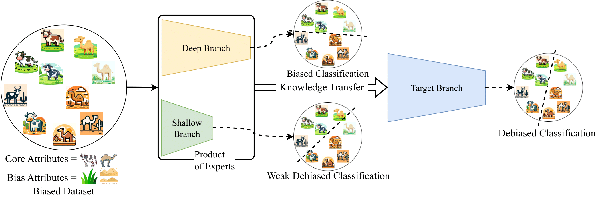

<div align="center">    
 
# DeNetDM: A PyTorch Implementation for Debiasing Neural Networks through Depth Modulation

[](https://arxiv.org/abs/2403.19863)
[](https://nips.cc/virtual/2024/poster/96916)

</div>

## Table of Contents

- [Abstract](#abstract)
- [Installation](#installation)
- [Datasets](#datasets)
- [Training](#training)
- [Pretrained Models](#pretrained-models)
- [Evaluation](#evaluation)
- [Updates](#updates)
- [Acknowledgements](#acknowledgements)
- [Citation](#citation)
- [License](#license)

---

## Abstract

Neural networks often learn spurious correlations from biased datasets, leading to poor generalization. **DeNetDM** introduces a novel debiasing method leveraging network depth. Shallow networks prioritize core attributes, while deeper ones emphasize biases. We create biased and debiased branches, distill knowledge from both, and train a model that outperforms existing methods on multiple datasets without requiring bias labels or explicit augmentation techniques. Our approach demonstrates a performance improvement of approximately 5% across three datasets (synthetic and real-world), all without bias annotations, achieving comparable results to supervised debiasing approaches.

<p align="center">
  
</p>

---

## Installation

First, clone the repository and set up the environment:

```bash
git clone https://github.com/kadarsh22/DeNetDM  # Clone the project
cd DeNetDM                                      # Navigate into the project directory
conda env create -f denetdm.yml                 # Create a conda environment with dependencies
conda activate denetdm                          # Activate the environment
```

---

## Datasets

You can generate or download the necessary datasets as described below:

- **ColoredMNIST**: Follow the instructions from the [Learning from Failure repository](https://github.com/alinlab/LfF) to set up generate the dataset.
- **CorruptedCIFAR10**: Use the instructions from the same repository above for the CorruptedCIFAR10.
- **BFFHQ**: Download the dataset from [BFFHQ](https://github.com/kakaoenterprise/Learning-Debiased-Disentangled).

Once the datasets are ready, place them in a directory that is accessible by your project and update the config.py file with the corresponding path

---

## Training

Run the following command to start training on the dataset of your choice:

```bash
bash scripts/$DATASET.sh
```

Replace `$DATASET` with one of the following options:
- `coloredmnist`
- `corruptedcifar10`
- `bffhq`

For example, to run the training on ColoredMNIST:

```bash
bash scripts/coloredmnist.sh
```

---

## Pretrained Models

Pretrained models can be downloaded from [this Google Drive link](https://drive.google.com/drive/folders/1lajUDMpj9g0wwS_eFMqNHyVczSVrdwLJ?usp=sharing). 

### Using Pretrained Models

1. Download the models and place them in the `pretrained_models/` directory.
2. Update the `config.py` file of the corresponding dataset to point to the pretrained model.
3. Set `train = False` in `main.py`.
4. Run the evaluation (see the next section for details).

---

## Evaluation

Once you've set up the pretrained models, you can evaluate them using the following commands:

```bash
python main.py with colored_mnist skewed1 severity4     # Evaluate on ColoredMNIST
python main.py with corrupted_cifar10 skewed1 severity4 # Evaluate on CorruptedCIFAR10
python3 main.py with bffhq                                          # Evaluate on BFFHQ dataset
```

Ensure the path to the pretrained model is correctly set in the `config.py` file for each dataset before running the evaluation code.

---

## Updates

- **September 27, 2024**: Paper accepted to [NeurIPS 2024](https://nips.cc/virtual/2024/poster/96916).
- **October 24, 2024**: [arXiv version](https://arxiv.org/abs/2403.19863) posted, code released.
- **December 12, 2024**: Poster presentation at NeurIPS 2024.

---

## Acknowledgements

This code is partly based on the open-source implementations from the following projects:
- [Learning from Failure (LfF)](https://github.com/alinlab/LfF)
- [Debiased Feature Attribution (DFA)](https://github.com/kakaoenterprise/Learning-Debiased-Disentangled).

---

## Citation

If you find this code or idea useful, please cite our work: 

```bib
@misc{sreelatha2024denetdmdebiasingnetworkdepth,
      title={DeNetDM: Debiasing by Network Depth Modulation}, 
      author={Silpa Vadakkeeveetil Sreelatha and Adarsh Kappiyath and Abhra Chaudhuri and Anjan Dutta},
      year={2024},
      eprint={2403.19863},
      archivePrefix={arXiv},
      primaryClass={cs.LG},
      url={https://arxiv.org/abs/2403.19863}, 
}
```

---

## License

This project is licensed under the MIT License - see the [LICENSE](LICENSE) file for details.
